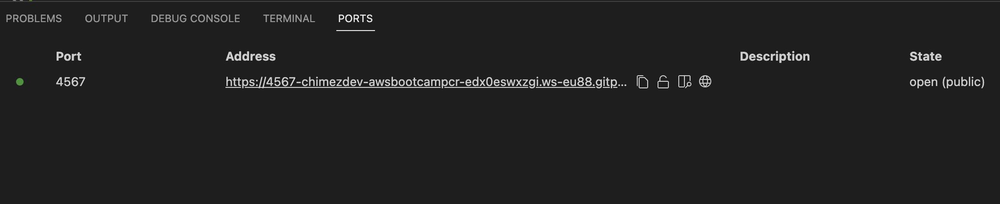
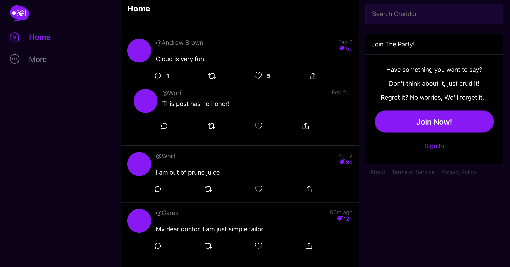

# Week 1 — App Containerization

App containerization provides Flexibility, Ease of Management, Speed of Transportation, Economies of Scale, and Durability.
DockerHub is a central container registry for storing docker container images. It follows the OCI standard for registries.

# Running our application locally
## Run the backend application locally
- `cd` in the **backend-flask** directory and run `pip3 install -r requirements.txt` to install the packages
- run `python3 -m flask run --host=0.0.0.0 --port=4567` # shortcut way of running flask app
- click on the **PORT** tab in the terminal and click on the padlock icon in the url to open the link to the public

- click on the link to open it. this should not open because we did not provide the required environment variables.
- in your terminal run, `export FRONTEND_URL="*"` and `export BACKEND_URL="*"`
- run `python3 -m flask run --host=0.0.0.0 --port=4567` to start the server again 
- append **/api/activities/home** to the url found on the *PORT* tab and reload.
- Now our backend application is running.

# STEPS to containerize our application
- first run `unset FRONTEND` to unset the env variables we set earlier.
- run `cd ..` to go to the home directory.

## Build and containerize the flask backend app
- create a new file, ***Dockerfile*** in the *backend-flask* directory
- copy and paste this block of code into it.
```
    FROM python:3.10-slim-buster

    # Inside Container / make the folder 'backend-flask '
    WORKDIR /backend-flask

    # Outside Container -> Inside Container

    COPY requirements.txt requirements.txt

    RUN pip3 install -r requirements.txt

    # first '.' means everything inside the backend-flask folder outside container into the 'backend-flask' folder inside the container
    COPY . .

    ENV FLASK_ENV=development

    EXPOSE ${PORT}

    # python3 -m flask run --host=0.0.0.0 --port=4567
    CMD [ "python3", "-m" , "flask", "run", "--host=0.0.0.0", "--port=4567"]

```
- run `docker build -t  backend-flask ./backend-flask` to build our docker image.
- after successful build, you can run `docker images` to see the images.
- now run `docker build -t  backend-flask ./backend-flask` to build into a container.
- go to the 'PORT' tab on the terminal confirm that the padlock symbol is open
- click on the url to open. This will return 404 because we have not set the environment variable.
- run `docker kill` command to stop the container
- run `set FRONTEND_URL="*"` and `set BACKEND_URL="*"` to set the env.
- Now run `docker run --rm -p 4567:4567 -it -e FRONTEND_URL='*' -e BACKEND_URL='*' backend-flask`
- click on the url on the 'PORT' tab remember to appen */api/activities/home
- you can open a new terminal and run `docker ps` to see the containers that are running.
- do `control +C` to kill the containers.

## Containerize the frontend
- cd into ***frontend-react-js*** 
- run `npm install`
- create a **Dockerfile** at the frontend directory, paste and save this code
```
    FROM node:16.18

    ENV PORT=3000

    COPY . /frontend-react-js
    WORKDIR /frontend-react-js
    RUN npm install
    EXPOSE ${PORT}
    CMD ["npm", "start"]
```
- cd back to the home directory by running `cd ..`
- run `docker build -t frontend-react-js ./frontend-react-js`
- run `docker run -p 3000:3000 -d frontend-react-js`
- you can repeat the steps to see if the app is running and try opening it your browser tab.

## Building multiple containers using docker-compose
- Create ***docker-compose.yml*** at the root of your project.
- copy and save this code to it
```
    version: "3.8"
    services:
    backend-flask:
        environment:
        FRONTEND_URL: "https://3000-${GITPOD_WORKSPACE_ID}.${GITPOD_WORKSPACE_CLUSTER_HOST}"
        BACKEND_URL: "https://4567-${GITPOD_WORKSPACE_ID}.${GITPOD_WORKSPACE_CLUSTER_HOST}"
        build: ./backend-flask
        ports:
        - "4567:4567"
        volumes:
        - ./backend-flask:/backend-flask
    frontend-react-js:
        environment:
        REACT_APP_BACKEND_URL: "https://4567-${GITPOD_WORKSPACE_ID}.${GITPOD_WORKSPACE_CLUSTER_HOST}"
        build: ./frontend-react-js
        ports:
        - "3000:3000"
        volumes:
        - ./frontend-react-js:/frontend-react-js

    # the name flag is a hack to change the default prepend folder
    # name when outputting the image names
    networks: 
    internal-network:
        driver: bridge
        name: cruddur
```
- run `docker-compose up`, this will build both the backend and frontend app all at once.
- go to the 'PORT' tab and confirm that both urls with ports 3000 and 4567 are running and open to the public
- click on the frontend(port 3000) url to open in a new tab
- you should see our app up with data showing that our frontend is able to communicate with the backend.


#  To install the postgres client into Gitpod
``` 
    - name: postgres
        init: |
        curl -fsSL https://www.postgresql.org/media/keys/ACCC4CF8.asc|sudo gpg --dearmor -o /etc/apt/trusted.gpg.d/postgresql.gpg
        echo "deb http://apt.postgresql.org/pub/repos/apt/ `lsb_release -cs`-pgdg main" |sudo tee  /etc/apt/sources.list.d/pgdg.list
        sudo apt update
        sudo apt install -y postgresql-client-13 libpq-dev
```
