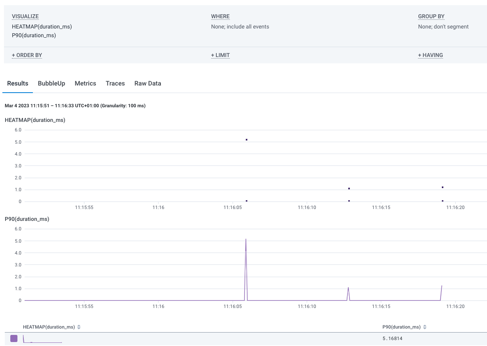

# Week 2 — Distributed Tracing

## Honeycomb setup
Honeycomb is an observability tool that allow you gain insight into performance of your solution.
Honeycomb offers free-tier pricing option. To setup a Honeycomb account:
- Go to ***honeycomb.io***
- click on the **Pricing**, the **Get Started** to create a free account.
- follow the steps in this [Honeycomb](https://www.youtube.com/watch?v=2GD9xCzRId4&list=PLBfufR7vyJJ7k25byhRXJldB5AiwgNnWv&index=31) to create environment and copy your API-Key.
- Run the command, `export HONEYCOMB_API_KEY="wWxmjac8EHWONJnQE6xIxD"` to set it as environment variable
- Run, `gp env HONEYCOMB_API_KEY="wWxmjac8EHWONJnQE6xIxD"` to allow gitpod to grab it when next it loaded.
- Install these Honeycomb packages by running:
    ```
        pip install opentelemetry-api \
        opentelemetry-sdk \
        opentelemetry-exporter-otlp-proto-http \
        opentelemetry-instrumentation-flask \
        opentelemetry-instrumentation-requests
    ```
- Next, add the following to the **app.py** file
    ```
    from opentelemetry import trace
    from opentelemetry.instrumentation.flask import FlaskInstrumentor
    from opentelemetry.instrumentation.requests import RequestsInstrumentor
    from opentelemetry.exporter.otlp.proto.http.trace_exporter import OTLPSpanExporter
    from opentelemetry.sdk.trace import TracerProvider
    from opentelemetry.sdk.trace.export import BatchSpanProcessor
    ```
    ```
        # Initialize tracing and an exporter that can send data to Honeycomb
        provider = TracerProvider()
        processor = BatchSpanProcessor(OTLPSpanExporter())
        provider.add_span_processor(processor)
        trace.set_tracer_provider(provider)
        tracer = trace.get_tracer(__name__)
    ```
    ```
        # Initialize automatic instrumentation with Flask
        app = Flask(__name__)
        FlaskInstrumentor().instrument_app(app)
        RequestsInstrumentor().instrument()
    ```
- Configure OpenTelemetry, OTEL to send events to Honeycomb by setting some env variables to the docker-compose file. 
```
    OTEL_SERVICE_NAME: "your-service-name"
    OTEL_EXPORTER_OTLP_ENDPOINT: "https://api.honeycomb.io"
    OTEL_EXPORTER_OTLP_HEADERS: "x-honeycomb-team=${HONEYCOMB_API_KEY}"
```
- Next, go to the 'frontend-react-js' directory and run `npm install`
- run `cd ..` and then run `docker-compose up`
- after the build completes, go to the **PORT** tab amd open the ports for public accessibility. To automate this:
- add the following to the *gitpod.yml* file
```
    ports:
        - name: frontend
          port: 3000
          onOpen: open-browser
          visibility: public
        - name: backend
          port:4567
          visibility: public
        - name: xray-daemon
          port: 2000
          visibility: public
```
- Now run `docker-compose up`
- After build the ports will be made public and the frontend will automatically open on a new tab

#challenges
I loaded a new github workspace and the FRONTEND_URL and BACKEND_URL environment variables were not set.
As a result I was getting the error message, '3000 port not found' 
It took me a while to debug this, but in the end, I got it sorted out.
docker compose doesn't find the environment variables when I write-click on the file and click `compose up`
What I did instead was to run `docker compose up` from the terminal that I exported the env variables from.
AWS CLI doesn't automatically install when I launch gitpod. After several troubleshooting, I was able to resolve it by removing this line of code. `cd /workspace` from the **gitpod.yml** as it is not necessary because the working directory is already set to the root of the Gitpod workspace ($THEIA_WORKSPACE_ROOT)

## Acquiring a Tracer.
To put span around home-activities endpoint to show return of hard-coded data to show in our trace story. 
- open **'home_activities.py'**
- go to this [honeycomb python doc](https://docs.honeycomb.io/getting-data-in/opentelemetry/python/)
- scroll down and copy the code and paste in the 'home_activities.py' file.
```
    from opentelemetry import trace
    tracer = trace.get_tracer("home.activities")

```
- Then copy `with tracer.start_as_current_span("home-activities-mock-data"):` into the **def run():** block.
- Add `span = trace.get_current_span()` below the above code and make sure the block is well indented.
- Add attributes to the span:
    - add the line `span.set_attribute("app.result_length", len(results))` at the buttom of **home_activities.py**, just before the return line.



## Instrument XRay
"Analyze and debug production and distributed applications. AWS X-Ray provides a complete view of requests as they travel through your application and filters visual data across payloads, functions, traces, services, APIs, and more with no-code and low-code motions." 
[AWS XRay python SDK](https://boto3.amazonaws.com/v1/documentation/api/latest/reference/services/xray.html)
- install the **aws-xray-sdk** by adding 'aws-xray-sdk' to the requirement.txt and running `pip install -r requirements.txt`
- export some env. variable `export AWS_REGION="us-east-1"` and `gp env AWS_REGION="us-east-1"`

## Add the middleware to our flask application
[XRay Middleware to flask app](https://docs.aws.amazon.com/xray/latest/devguide/xray-sdk-python-middleware.html)
- add the following block to the **app.py** file
```
    from aws_xray_sdk.core import xray_recorder
    from aws_xray_sdk.ext.flask.middleware import XRayMiddleware

    xray_url = os.getenv("AWS_XRAY_URL")
    xray_recorder.configure(service='backend-flask', dynamic_naming=xray_url)
    XRayMiddleware(app, xray_recorder)
```
- The above tells X-Ray recorder to trace requests served by your Flask application with the default sampling rate.
- create aws/json/xray.json to set up AWS XRay resources.
```
    {
        "SamplingRule": {
            "RuleName": "Cruddur",
            "ResourceARN": "*",
            "Priority": 9000,
            "FixedRate": 0.1,
            "ReservoirSize": 5,
            "ServiceName": "backend-fask",
            "ServiceType": "*",
            "Host": "*",
            "HTTPMethod": "*",
            "URLPath": "*",
            "Version": 1
        }
    }
```
- Create xray group. Xray new console is now integrated with cloudwatch so this group will create in the cloudwatch console.
- go to the xray console. If it takes you to the 'welcome' page, just click on **Get Started** and then **cancel**
- ensure you are on the region you exported earlier.
- Then on your terminal, run ```aws xray create-group \
   --group-name "Cruddur" \
   --filter-expression "service(\"backend-flask\")"
   ```
- run `aws xray create-sampling-rule --cli-input-json file://aws/json/xray.json` to create sampling rule on xray
- Install xray daemon by adding this to the **docker-compose.yml** file
```
    xray-daemon:
        image: "amazon/aws-xray-daemon"
        environment:
            AWS_ACCESS_KEY_ID: "${AWS_ACCESS_KEY_ID}"
            AWS_SECRET_ACCESS_KEY: "${AWS_SECRET_ACCESS_KEY}"
            AWS_REGION: "us-east-1"
        command:
            - "xray -o -b xray-daemon:2000"
        ports:
            - 2000:2000/udp
```
- Add the following env variable to the **docker-compose** file
```
      AWS_XRAY_URL: "*4567-${GITPOD_WORKSPACE_ID}.${GITPOD_WORKSPACE_CLUSTER_HOST}*" 
      AWS_XRAY_DAEMON_ADDRESS: "xray-daemon:2000"
```
- #AWS_XRAY_URL is a dynamic naming that we passed in **app.py**
